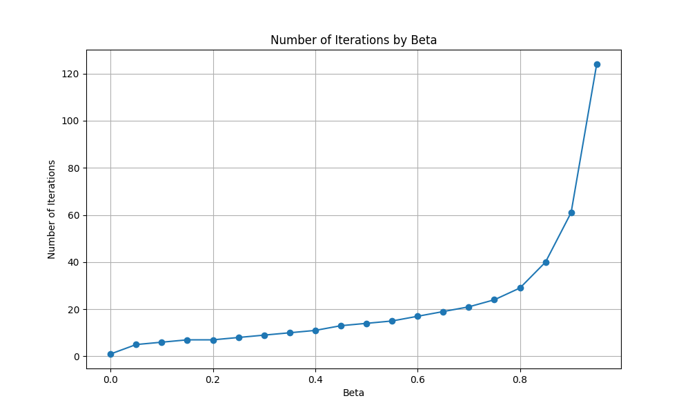
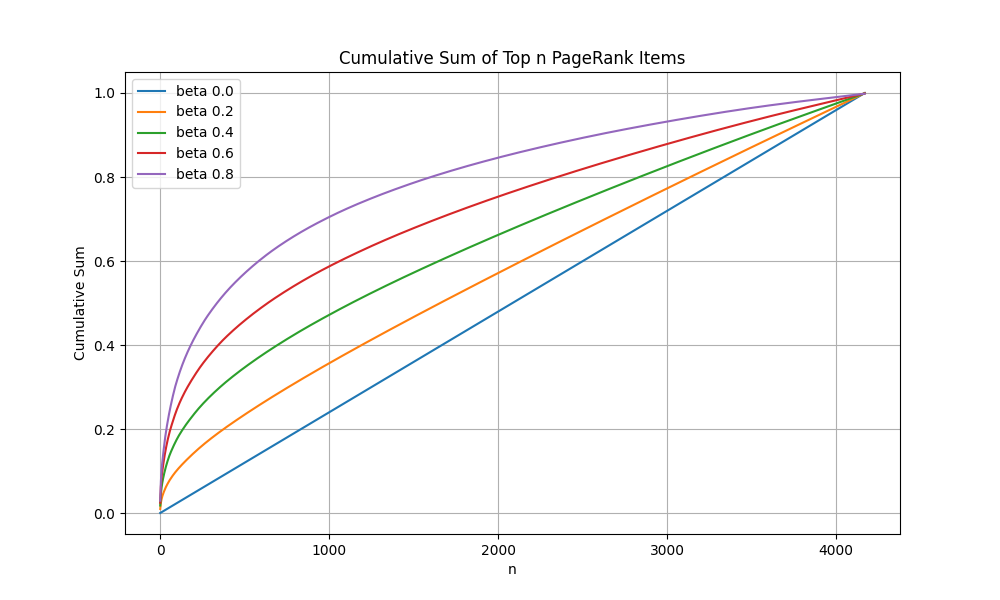

# Rapport de Projet Big Data : PageRank sur Wikispeedia

## 1. Introduction

Ce projet a pour but d'analyser le graphe de navigation du jeu Wikispeedia en utilisant l'algorithme PageRank. Wikispeedia est un jeu où les utilisateurs doivent naviguer d'un article Wikipédia source à un article cible en cliquant uniquement sur les liens hypertexte.

L'objectif est de comprendre la structure de ce graphe, d'identifier les pages les plus importantes (centrales) via le PageRank standard, et d'explorer comment cette importance change lorsque l'on personnalise l'algorithme pour favoriser certains thèmes.

## 2. Les Données

### Gestion et Nettoyage

Les données proviennent du fichier `paths_finished.tsv`. Ce fichier contient les chemins complets parcourus par les utilisateurs qui ont réussi à atteindre la cible.

Le nettoyage des données est effectué dans `load_data.py` :

- **Parsage** : Les lignes de commentaires (commençant par `#`) et les lignes incomplètes sont ignorées.
- **Gestion des retours** : Le symbole `<` indique un clic sur le bouton "précédent". L'algorithme de nettoyage simule ce comportement en retirant la dernière page visitée de la liste courante pour revenir à la précédente.

### Structures

Une fois les chemins nettoyés, ils sont transformés en une matrice de transition dans `format_data.py` :

- **Map Key** : Un dictionnaire associe chaque nom d'article unique à un index entier (0 à N-1).
- **Matrice d'Adjacence** : Une matrice carrée `(N+1) x (N+1)` est créée. Pour chaque transition d'une page A à une page B dans un chemin, on incrémente le compteur correspondant dans la matrice.
- **Normalisation** : La matrice est normalisée par ligne pour obtenir une matrice stochastique (la somme de chaque ligne vaut 1, sauf pour les "puits" qui valent 0).

### Outils Utilisés

- **Python** : Langage principal.
- **NumPy** : Pour les manipulations matricielles efficaces.
- **Matplotlib** : Pour la génération des courbes et graphiques.

## 3. PageRank

### Choix des structures de données

L'algorithme PageRank est implémenté dans `pageRank.py`. Il utilise des opérations vectorielles NumPy pour la rapidité.

- `matrix_norm` : Matrice de transition (M).
- `v` : Vecteur de personnalisation (ou de saut aléatoire), par défaut uniforme ($1/N$).
- `q` : Vecteur de score PageRank, initialisé uniformément.

### Expérimentations

L'algorithme itère jusqu'à ce que la norme de la différence entre deux itérations successives soit inférieure à $\epsilon = 10^{-8}$.

**Convergence en fonction de Beta** :
Le paramètre d'amortissement beta ($b$) contrôle la probabilité de suivre un lien (vs saut aléatoire).

- **Observations** :
  - Pour $b=0$, la convergence est immédiate (1 itération). Le graphe n'a aucun effet, tout est uniforme.
  - Pour $b=0.85$ (standard), il faut 40 itérations.
  - Pour $b=0.95$, le nombre d'itérations explose à 124.
- **Analyse** : On observe une croissance quasi-exponentielle du nombre d'itérations nécessaire lorsque $b$ s'approche de 1. Plus $b$ est grand, plus l'effet "mémoire" est fort : le surfeur reste longtemps dans le réseau de liens avant de "téléporter". L'algorithme met donc plus de temps à stabiliser les probabilités stationnaires car l'information se propage plus lentement à travers les cycles du graphe.
- **Compromis** : Un $b$ élevé donne une mesure plus fidèle de la structure du graphe mais coûte plus cher en calcul. La valeur standard de 0.85 est un bon compromis historique.



### Précision et Arithmétique

L'implémentation utilise le type `float64` de NumPy. Ce choix est crucial pour l'arithmétique :

- **Précision ($\epsilon$)** : Nous avons fixé le seuil de convergence à $10^{-8}$. Une précision trop faible arrêterait l'algorithme prématurément avant que les scores des nœuds secondaires ne se stabilisent.
- **Stabilité Numérique** : Avec un grand nombre d'itérations (surtout pour $b$ proche de 1), les erreurs d'arrondi des multiplications matricielles peuvent s'accumuler. L'usage de flottants double précision garantit que la somme des probabilités reste égale à 1 et que les petites valeurs de PageRank ne sont pas écrasées par le bruit numérique.

### Analyse de la Précision et de la Répartition (Courbes Cumulatives)

Le fichier `cumulative_data.csv` et le graphique associé `cumulative_plot.png` montrent la somme cumulée des scores PageRank des $n$ meilleures pages pour différentes valeurs de beta.

- **Beta = 0.0 (Ligne droite)** : La répartition est parfaitement équitable. Chaque page a le même score ($1/N$). La courbe est donc une droite linéaire $y = x/N$.
- **Beta élevé (0.8)** : La courbe est fortement convexe. Cela indique une **concentration de l'importance**.
  - Les quelques premières pages captent une part énorme du "jus" de PageRank.
  - C'est typique des réseaux "Small World" ou "Scale-Free" (loi de puissance) : quelques hubs connectent tout le monde.
- **Comparaison** : Plus $b$ augmente, plus la courbe s'éloigne de la diagonale. Cela confirme que le PageRank (avec un $b$ fort) agit comme un filtre qui accentue les inégalités structurelles du graphe pour mettre en lumière les nœuds vraiment centraux.



### Analyse du Top 20 (Standard, $b=0.85$)

Voici les 20 pages les plus importantes selon le PageRank standard :

1. **United_States** (0.030456)
2. **Europe** (0.014135)
3. **United_Kingdom** (0.013161)
4. **England** (0.011706)
5. **Africa** (0.009398)
6. **Earth** (0.008097)
7. **World_War_II** (0.007838)
8. **Germany** (0.005853)
9. **North_America** (0.005661)
10. **France** (0.005429)
    ...

**Variation du Top 20 en fonction de Beta :**
Bien que le classement ci-dessus soit pour $b=0.85$, il varie selon ce paramètre :

- **Si $b \to 0$** : Le Top 20 perd son sens car tous les scores s'égalisent (toutes les pages sont ex-aequo).
- **Si $b \to 1$** : Le Top 20 devient extrêmement sensible à la topologie locale (puits de rang ou "Rank Sinks"). Certaines pages formant des cycles fermés pourraient monopoliser le score au détriment des hubs globaux comme "United_States". Le choix de 0.85 permet de conserver une hiérarchie globale robuste.

**Synthèse** : Les pages les plus centrales sont des concepts géographiques très généraux (Pays, Continents) et des événements historiques majeurs. Cela s'explique car ce sont des "hubs" naturels vers lesquels beaucoup de chemins convergent dans le jeu Wikispeedia.

## 4. PageRank Personnalisé

Le PageRank personnalisé modifie le comportement du surfeur aléatoire. **Il ne s'agit pas uniquement de changer le vecteur initial**, mais de modifier le vecteur de téléportation $v$ dans l'équation itérative :
$$ P\_{i+1} = b \cdot M \cdot P_i + (1-b) \cdot v $$
Ainsi, à chaque pas, le surfeur a une probabilité $(1-b)$ de se "téléporter" vers les pages cibles définies dans $v$, ce qui biaise durablement le classement stationnaire vers ces thèmes.

### Expérimentations (Thèmes)

Les thèmes suivants ont été testés avec $s=3$ (trois sujets distincts).

#### Thème : United_States

- **Vecteur $v$** : 1.0 sur "United_States", 0 ailleurs.
- **Top 3** : United_States, President_of_the_United_States, North_America.
- **Analyse** : L'observation du Top 20 complet montre une remontée spectaculaire des pages liées à la politique et géographie américaine (Président, Californie, New York), reléguant les autres continents plus bas dans le classement.

#### Thème : Science

- **Vecteur $v$** : 1.0 sur "Science", 0 ailleurs.
- **Top 3** : Science, Chemistry, Physics.
- **Analyse** : Le Top 20 est transformé : on voit une nette domination des disciplines scientifiques (Chimie, Physique, Biologie, Mathématiques). "United_States" reste présent (car très connecté structurellement) mais chute à la 5ème place.

#### Thème : Earth

- **Vecteur $v$** : 1.0 sur "Earth", 0 ailleurs.
- **Top 3** : Earth, United_States, Europe.
- **Analyse** : Dans le Top 20, des pages comme "Solar_System", "Sun", "Planet" remontent significativement, montrant un focus sur l'astronomie et la géographie physique au détriment de l'histoire ou de la politique.

### Synthèse

La personnalisation fonctionne comme attendu : elle "attire" le score vers le voisinage du nœud choisi. Cependant, les "super-hubs" comme United_States restent souvent présents car ils sont incontournables dans la structure globale du graphe, même avec un biais initial différent.

## 5. Conclusion

L'analyse du graphe Wikispeedia via PageRank révèle une structure fortement hiérarchisée autour de quelques grands concepts géographiques et historiques.

- Le **PageRank Standard** identifie ces carrefours universels.
- Le **PageRank Personnalisé** permet d'explorer des communautés thématiques (Science, Géographie, etc.) en faisant ressortir les pages pertinentes pour un contexte donné, tout en conservant l'influence structurelle des nœuds majeurs.

L'implémentation en Python avec NumPy s'est avérée efficace, convergeant en moins de 50 itérations pour les configurations testées, avec une précision arithmétique suffisante pour distinguer finement l'importance des pages.

## 6. Code

### loadData.py

```py
def add_or_replace(lst: list, index: int, value) -> list:
    if index >= len(lst):
        lst.append(value)
    else:
        lst[index] = value
    return lst


def format_pages(pages: list[str]) -> list[str]:
    override_pages = []
    result_pages = []
    override_index = 0
    current_index = 0
    for page in pages:
        if page == "<":
            add_or_replace(
                result_pages, current_index, override_pages[override_index - 2]
            )
            override_index -= 1
        else:
            add_or_replace(override_pages, override_index, page)
            add_or_replace(result_pages, current_index, page)
            override_index += 1

        current_index += 1

    return result_pages


def load_data(filePath: str = "paths_finished.tsv"):
    data = []
    with open(filePath, "r") as file:
        for line in file:
            if line.startswith("#"):
                continue
            parts = line.strip().split("\t")
            if len(parts) != 5:
                continue
            pages = parts[3].split(";")
            data.append(format_pages(pages))

    return data
```

### format_data.py

```py
def create_map_key(data: list[list[str]]) -> tuple[dict[str, int], int]:
    map_key = {}
    current_index = 0
    for path in data:
        for page in path:
            if page not in map_key:
                map_key[page] = current_index
                current_index += 1
    return (map_key, current_index - 1)


def get_name_by_index(map_key: dict[str, int], index: int) -> str:
    for name, idx in map_key.items():
        if idx == index:
            return name
    return ""


def group_by_city(data: list[list[str]]) -> tuple[np.ndarray, dict[str, int]]:
    map_key, size = create_map_key(data)
    res = np.zeros((size + 1, size + 1), dtype=int)
    for row in data:
        for i in range(len(row) - 1):
            page = (row[i], map_key[row[i]])
            next_page = (row[i + 1], map_key[row[i + 1]])
            res[page[1]][next_page[1]] += 1
    return (res, map_key)


def normalize_matrix(matrix: np.ndarray) -> np.ndarray:
    row_sums = matrix.sum(axis=1)
    normalized_matrix = np.zeros_like(matrix, dtype=np.float64)
    for i in range(matrix.shape[0]):
        if row_sums[i] != 0:
            normalized_matrix[i] = matrix[i] / row_sums[i]
    return normalized_matrix
```

### pageRank.py

```py
def page_rank(
    matrix_norm: np.ndarray,
    beta: float = 0.85,
    epsilone: float = 1e-8,
    number_of_iterations: int = 1000,
    v: np.ndarray = None,
):
    n = matrix_norm.shape[0]
    if v is None:
        v = np.ones(n) / n
    beta_p = beta * matrix_norm.transpose()
    q = np.ones(n) / n
    count = 0
    for _ in range(number_of_iterations):
        q_prev = q.copy()
        q = beta_p @ q + (1 - beta) * v
        count += 1
        if np.linalg.norm(q - q_prev) < epsilone:
            break
    return (q, count)
```

### main.py

```py
def main():
    initial_data = load_data()
    (matrix_initial, map_key) = group_by_city(initial_data)
    matrix_norm = normalize_matrix(matrix_initial)
    (res, count) = page_rank(matrix_norm)
    indices_sorted = np.argsort(res)[::-1]
    for i in range(15):
        print(
            f"page: {get_name_by_index(map_key, indices_sorted[i])}, PageRank: {res[indices_sorted[i]]}"
        )
```
