# TP 4

## Partie 1

### Question 1

```py
import matplotlib.pyplot as plt
import numpy as np
from statsmodels.graphics.tsaplots import plot_acf, plot_pacf


def load_data(filename="data/AR.txt"):
    with open(filename, "r") as f:
        data = f.readlines()
        res = np.array([float(line.strip()) for line in data])
        f.close()
        return res


def auto_correlation(data):
    fig, axes = plt.subplots(1, 2, figsize=(12, 4))
    plot_acf(data, lags=40, ax=axes[0], alpha=0.05, zero=False)
    plot_pacf(data, lags=40, ax=axes[1], alpha=0.05, zero=False, method="ywm")
    axes[0].set_title("Autocorrélation (ACF)")
    axes[1].set_title("Autocorrélation partielle (PACF)")
    for ax in axes:
        ax.set_xlabel("Retard")
    fig.tight_layout()


data = load_data("data/AR.txt")
auto_correlation(data)
plt.show()
```

En regardant l'autocorrélation on observe qu'elle diminue vers `0` ce qui fait bien penser à
un processus `AR`.
En regardant l'autocorrélation partielle on observe deux pics significatifs aux retards 1 et 2, puis des valeurs globalement proches de zéro, ce qui fait bien penser à
un processus `AR(2)`.

### Question 2

```py
from statsmodels.tsa.arima.model import ARIMA

def estime_params(data, order):
    model = ARIMA(data, order=order)
    results = model.fit()
    return results

results = estime_params(data, order=(2, 0, 0))
print(results.summary())
```

```
SARIMAX Results
==============================================================================
Dep. Variable:                      y   No. Observations:                  500
Model:                 ARIMA(2, 0, 0)   Log Likelihood                -718.125
Date:                Thu, 24 Sep 2026   AIC                           1444.251
Time:                        14:16:25   BIC                           1461.109
Sample:                             0   HQIC                          1450.866
 - 500
Covariance Type:                  opg
==============================================================================
coef    std err          z      P>|z|      [0.025      0.975]
------------------------------------------------------------------------------
const          0.0427      0.179      0.239      0.811      -0.308       0.393
ar.L1          1.0014      0.041     24.601      0.000       0.922       1.081
ar.L2         -0.2555      0.043     -5.900      0.000      -0.340      -0.171
sigma2         1.0328      0.072     14.255      0.000       0.891       1.175
===================================================================================
Ljung-Box (L1) (Q):                   0.04   Jarque-Bera (JB):                 2.92
Prob(Q):                              0.84   Prob(JB):                         0.23
Heteroskedasticity (H):               0.83   Skew:                            -0.03
Prob(H) (two-sided):                  0.23   Kurtosis:                         2.63
===================================================================================
```

Le paramètre `order=(p, d, q)` définit les ordres du modèle. Ici, on utilise
`order=(2, 0, 0)` :

- `p=2` : deux retards de la série dans la partie AR, soit $X_{t-1}$ et $X_{t-2}$.
- `d=0` : aucune différenciation appliquée à la série.
- `q=0` : aucun retard du bruit dans une partie MA.

Un ARIMA(2, 0, 0) est donc un AR(2). La fonction `estime_params` pourra aussi
servir pour les modèles MA et ARMA.

**Explication des résultats**

| Paramètre | Interprétation | Estimation |
|---|---|---:|
| `const` | Espérance $\mu$ de la série dans cette paramétrisation | 0,0427 |
| `sigma2` | Variance du bruit $\sigma_\varepsilon^2$ | 1,0328 |
| `ar.L1` | $\phi_1$, coefficient du retard 1 | 1,0014 |
| `ar.L2` | $\phi_2$, coefficient du retard 2 | −0,2555 |

Avec la convention de [`ARIMA` dans statsmodels](https://www.statsmodels.org/stable/generated/statsmodels.tsa.arima.model.ARIMA.html),
le modèle s'écrit sous forme centrée :

$$
X_t-\mu=\phi_1(X_{t-1}-\mu)+\phi_2(X_{t-2}-\mu)+\varepsilon_t.
$$

La constante additive de l'équation non centrée vaut donc
$c=\mu(1-\phi_1-\phi_2)\approx 0{,}01085$. Le modèle estimé est :

$$
X_t\approx 0{,}01085+1{,}0014X_{t-1}-0{,}2555X_{t-2}+\varepsilon_t.
$$

Les deux coefficients AR sont significativement différents de zéro : leurs
intervalles de confiance à 95 % ne contiennent pas zéro. Ils sont proches des
coefficients de simulation $1$ et $-1/4$. La moyenne estimée est compatible
avec zéro (p-valeur de 0,811).

### Question 3

```python
def calcule_racine(phi1, phi2):
    return np.roots([-phi2, -phi1, 1])


def is_stationary():
    return np.all(np.abs(calcule_racine(1, -1 / 4)) > 1)
```

`np.roots` attend les coefficients du polynôme par puissances décroissantes.
Pour les coefficients de simulation $\phi_1=1$ et $\phi_2=-1/4$, le polynôme
autorégressif est :

$$
P(z)=1-\phi_1z-\phi_2z^2=1-z+\frac14z^2
=\left(1-\frac z2\right)^2.
$$

Il possède une racine double égale à $2$. Les racines ont donc un module
strictement supérieur à $1$ : le processus AR(2) est stationnaire et la
fonction `is_stationary()` renvoie `True` pour ces coefficients.

Le fait que $\phi_1=1$ ne suffit pas à conclure à une non-stationnarité : il
faut tenir compte des deux coefficients ensemble.

### Question 4

```python
def display_residus(residus):
    fig, axes = plt.subplots(1, 2, figsize=(12, 4))

    axes[0].plot(residus)
    axes[0].axhline(0, color="red", linestyle="--")
    axes[0].set_title("Résidus")

    plot_acf(residus, lags=40, ax=axes[1], zero=False)
    axes[1].set_title("ACF des résidus")

    plt.tight_layout()


display_residus(results.resid)
plt.show()
```

- Les résidus fluctuent autour de zéro, sans tendance ni périodicité visible.
- Leur dispersion semble relativement constante au cours du temps.
- L’ACF est proche de zéro à presque tous les retards, sans structure
  persistante.
- Un pic dépasse légèrement la bande de confiance vers le retard 8. Un
  dépassement isolé parmi 40 retards n’est pas inhabituel avec des bandes à 95
  % et ne suffit pas à remettre en cause le modèle.

Les résidus sont visuellement centrés autour de zéro, de variance approximativement constante et ne présentent pas d’autocorrélation notable persistante. Ils sont donc compatibles avec un bruit blanc. La modélisation AR(2) semble ainsi bien rendre compte de la dépendance temporelle des données.

Les diagnostics du résumé sont également favorables : le test de Ljung–Box
au retard 1 donne une p-valeur de 0,84 et ne détecte pas d'autocorrélation à
ce retard. Le test d'hétéroscédasticité (p-valeur de 0,23) ne détecte pas de
variation de variance. Le test de Jarque–Bera (p-valeur de 0,23) ne rejette
pas la normalité, qui n'est toutefois pas nécessaire pour un bruit blanc.
Le Ljung–Box affiché porte seulement sur le retard 1 et ne valide donc pas,
à lui seul, l'absence d'autocorrélation à tous les retards.

### Question 5

On reprend les mêmes étapes pour `MA.txt` et `ARMA.txt`, en réutilisant les
fonctions définies précédemment. L'identification et l'estimation du modèle
MA ci-dessous ont été calculées sur les 500 observations de `MA.txt`.
L'analyse du fichier `ARMA.txt` et les diagnostics des résidus sont également
calculés ci-dessous. Le script `tp4_suite.py` reproduit les calculs et les
figures de la suite du TP avec l'environnement Python existant.

#### Observation des autocorrélations

```python
data_ma = load_data("data/MA.txt")
data_arma = load_data("data/ARMA.txt")

auto_correlation(data_ma)
plt.gcf().suptitle("Processus MA")
plt.tight_layout(rect=(0, 0, 1, 0.92))
plt.show()

auto_correlation(data_arma)
plt.gcf().suptitle("Processus ARMA")
plt.tight_layout(rect=(0, 0, 1, 0.92))
plt.show()
```

| Type de processus | ACF | PACF |
|---|---|---|
| AR($p$) | Décroissance progressive | Coupure après le retard $p$ |
| MA($q$) | Coupure après le retard $q$ | Décroissance progressive |
| ARMA($p,q$) | Généralement pas de coupure nette | Généralement pas de coupure nette |

Ces propriétés concernent les corrélations théoriques : sur les graphiques
empiriques, les valeurs après une coupure restent globalement proches de
zéro, avec des fluctuations d'échantillonnage.

Pour `MA.txt`, les premières autocorrélations empiriques sont :

| Retard | ACF |
|---|---:|
| 1 | 0,7001 |
| 2 | 0,3550 |
| 3 | 0,1174 |
| 4 | −0,0439 |
| 5 | −0,0443 |
| 6 | −0,0303 |

L'ACF diminue fortement sur les trois premiers retards, puis fluctue autour
de zéro. La PACF présente encore plusieurs pics à des retards supérieurs.
Le troisième retard de l'ACF reste toutefois dans la bande à 95 % affichée
par défaut par `plot_acf` : le graphique seul ne distingue donc pas
nettement MA(2) de MA(3). On complète cette lecture par une comparaison des
critères d'information, qui conduit à retenir **MA(3)**.

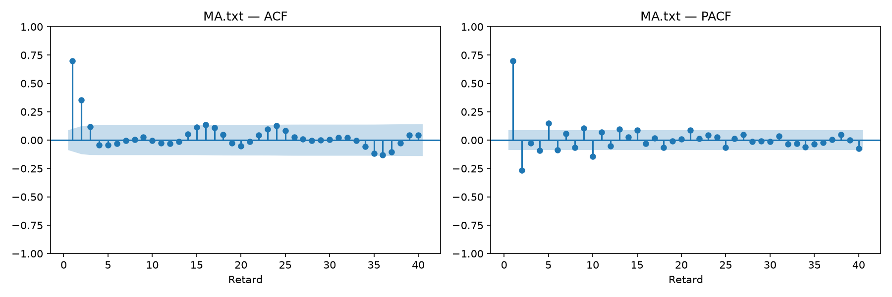

Pour `ARMA.txt`, l'ACF oscille en s'amortissant : les premières valeurs sont
0,808, 0,382, −0,009, −0,192 et −0,165. La PACF ne présente pas non plus de
coupure nette. Ces observations sont compatibles avec un processus ARMA,
mais ne suffisent pas à fixer les ordres : on compare plusieurs modèles.

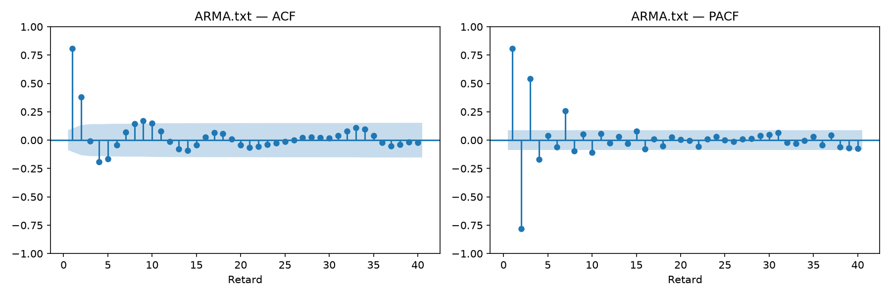

#### Estimation des coefficients

Pour le processus MA, on utilise `order=(0, 0, q)`. Les ajustements des
modèles MA d'ordres 0 à 5 sur `MA.txt` donnent les valeurs suivantes ; tous
ont convergé :

| Ordre $q$ | AIC | BIC |
|---|---:|---:|
| 0 | 1831,980 | 1840,409 |
| 1 | 1510,877 | 1523,520 |
| 2 | 1491,120 | 1507,979 |
| **3** | **1423,947** | **1445,020** |
| 4 | 1424,650 | 1449,938 |
| 5 | 1426,344 | 1455,846 |

Les deux critères sont minimaux pour **$q=3$** parmi les ordres comparés.
L'AIC du MA(4) est proche, mais sa complexité supplémentaire n'améliore
aucun des deux critères. On retient donc `order=(0, 0, 3)`.

```python
q = 3
results_ma = estime_params(data_ma, order=(0, 0, q))
print(results_ma.summary())
```

Les paramètres estimés sont :

| Paramètre | Estimation |
|---|---:|
| `const` ($\mu$) | −0,0723 |
| `ma.L1` ($\theta_1$) | 0,9737 |
| `ma.L2` ($\theta_2$) | 0,5310 |
| `ma.L3` ($\theta_3$) | 0,4061 |
| `sigma2` ($\sigma_\varepsilon^2$) | 0,9870 |

Le modèle estimé s'écrit donc :

$$
X_t\approx -0{,}0723+\varepsilon_t+0{,}9737\varepsilon_{t-1}
+0{,}5310\varepsilon_{t-2}+0{,}4061\varepsilon_{t-3}.
$$

Les coefficients `ma.L1`, `ma.L2`, etc. sont les coefficients des bruits
passés dans le modèle :

$$
X_t-\mu=\varepsilon_t+\theta_1\varepsilon_{t-1}
+\cdots+\theta_q\varepsilon_{t-q}.
$$

Pour le processus ARMA, on compare les candidats suivants sur la même série,
sans différenciation :

```python
ordres = [
    (1, 0, 1), (1, 0, 2), (2, 0, 1), (2, 0, 2),
    (2, 0, 3), (3, 0, 3), (2, 0, 4),
]
modeles = {}

for ordre in ordres:
    resultat = estime_params(data_arma, order=ordre)
    modeles[ordre] = resultat
    print(f"{ordre} : AIC={resultat.aic:.2f}, BIC={resultat.bic:.2f}")

meilleur_ordre = min(modeles, key=lambda ordre: modeles[ordre].aic)
results_arma = modeles[meilleur_ordre]

print("Ordre retenu selon l'AIC :", meilleur_ordre)
print(results_arma.summary())
```

Un AIC plus faible est préférable parmi les modèles comparés. Le BIC est
également affiché et pénalise davantage le nombre de paramètres pour cet
échantillon. Le choix fait ici selon l'AIC reste à valider par l'analyse des
résidus et suppose que les ajustements ont convergé.

| Modèle | AIC | BIC |
|---|---:|---:|
| ARMA(1,1) | 1693,450 | 1710,309 |
| ARMA(1,2) | 1592,063 | 1613,136 |
| ARMA(2,1) | 1502,821 | 1523,894 |
| ARMA(2,2) | 1504,813 | 1530,101 |
| **ARMA(2,3)** | **1459,238** | **1488,740** |
| ARMA(3,3) | 1461,060 | 1494,777 |
| ARMA(2,4) | 1461,063 | 1494,780 |

Les modèles limités à $p,q\leq 2$ laissent des résidus autocorrélés : pour
ARMA(2,1), le test de Ljung–Box à 20 retards donne une p-valeur de
$1{,}43\times10^{-5}$. Il faut donc élargir la comparaison. On retient
**ARMA(2,3)**, dont les AIC et BIC sont les plus faibles dans ce tableau et
dont les résidus passent les tests d'absence d'autocorrélation ci-dessous.

| Paramètre | Estimation |
|---|---:|
| $\mu$ | 0,4076 |
| $\phi_1$ | 0,9009 |
| $\phi_2$ | −0,4894 |
| $\theta_1$ | 1,1648 |
| $\theta_2$ | 0,7367 |
| $\theta_3$ | 0,4752 |
| $\sigma_\varepsilon^2$ | 1,0429 |

Le modèle ARMA combine les coefficients `ar.L1`, etc. et `ma.L1`, etc. :

$$
X_t-\mu=\sum_{i=1}^{p}\phi_i(X_{t-i}-\mu)
+\varepsilon_t+\sum_{j=1}^{q}\theta_j\varepsilon_{t-j}.
$$

Comme pour l'AR, `const` représente ici la moyenne du processus et `sigma2`
la variance du bruit.

#### Stationnarité

Un MA d'ordre fini est stationnaire lorsque les innovations forment un bruit
blanc de variance finie, quelles que soient les valeurs de ses coefficients.

Pour un ARMA sous sa forme causale, on vérifie que les racines de son
polynôme AR $1-\phi_1z-\cdots-\phi_pz^p$ ont toutes un module strictement
supérieur à 1 :

```python
# Coefficients du polynôme par puissances décroissantes.
racines_ar = np.roots(np.r_[-results_arma.arparams[::-1], 1])

print("Racines AR :", racines_ar)
print("Stationnaire :", np.all(np.abs(racines_ar) > 1))
```

Par défaut, `ARIMA` impose la stationnarité de la partie AR pendant
l'estimation. Ce contrôle concerne donc le modèle ajusté, et ne prouve pas
à lui seul la stationnarité de la série observée.

Pour l'ARMA(2,3) estimé, les racines AR sont environ
$0{,}9204\pm1{,}0937i$, de module $1{,}4294>1$ : le modèle est stationnaire.
Le MA(3) est stationnaire par construction.

#### Analyse des résidus

```python
for nom, resultat in [("MA", results_ma), ("ARMA", results_arma)]:
    display_residus(resultat.resid)
    plt.gcf().suptitle(f"Diagnostic du modèle {nom}")
    plt.tight_layout(rect=(0, 0, 1, 0.92))
    plt.show()
```

Pour chaque modèle, on vérifie que les résidus fluctuent autour de zéro,
que leur dispersion reste relativement constante et que leur ACF ne montre
pas de structure persistante. Quelques dépassements isolés de la bande de
confiance ne suffisent pas à invalider un modèle.

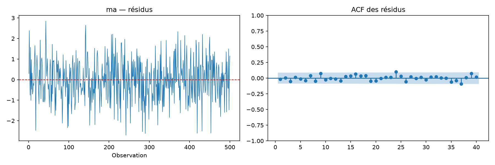

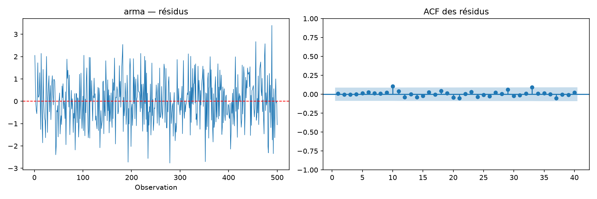

On complète les graphiques par le test de Ljung–Box. Son hypothèse nulle
est l'absence d'autocorrélation jusqu'au retard testé. `model_df=p+q`
corrige les degrés de liberté pour les coefficients AR et MA estimés.

```python
from statsmodels.stats.diagnostic import acorr_ljungbox

print(acorr_ljungbox(results_ma.resid, lags=[10, 20, 30], model_df=3))
print(acorr_ljungbox(results_arma.resid, lags=[10, 20, 30], model_df=5))
```

| Modèle | p-valeur à 10 retards | À 20 retards | À 30 retards |
|---|---:|---:|---:|
| MA(3) | 0,380 | 0,551 | 0,642 |
| ARMA(2,3) | 0,247 | 0,703 | 0,875 |

Les résidus sont visuellement centrés, sans structure persistante, avec une
dispersion assez stable. Aucune de ces p-valeurs n'est inférieure à 5 % :
les diagnostics sont compatibles avec des bruits blancs. Les modèles MA(3)
et ARMA(2,3) semblent donc fidèles à la dépendance temporelle des données.
Le test de Jarque–Bera ne rejette pas non plus la normalité (p-valeurs de
0,723 et 0,595), sans que cela constitue une preuve de normalité.

## Partie 2 — Prédiction d'un processus

On utilise les 300 observations du fichier `data/Exercice2.txt`. Les temps
sont numérotés de 1 à 300 ; les prévisions porteront sur les temps 301 à 320.

### Question 1 — Peut-on utiliser directement un ARMA ?

```python
data_prediction = load_data("data/Exercice2.txt")
plt.plot(np.arange(1, len(data_prediction) + 1), data_prediction)
plt.title("Série initiale — Exercice 2")
plt.xlabel("Temps")
plt.show()
auto_correlation(data_prediction)
plt.show()
```

La série présente une forte tendance croissante : son niveau passe
d'environ 3 à 148. Elle ne paraît donc pas stationnaire autour d'une moyenne
constante. Son ACF décroît très lentement : environ 0,989 au retard 1 et
0,873 au retard 12. Un ARMA stationnaire à moyenne constante ne convient pas
directement à cette série.

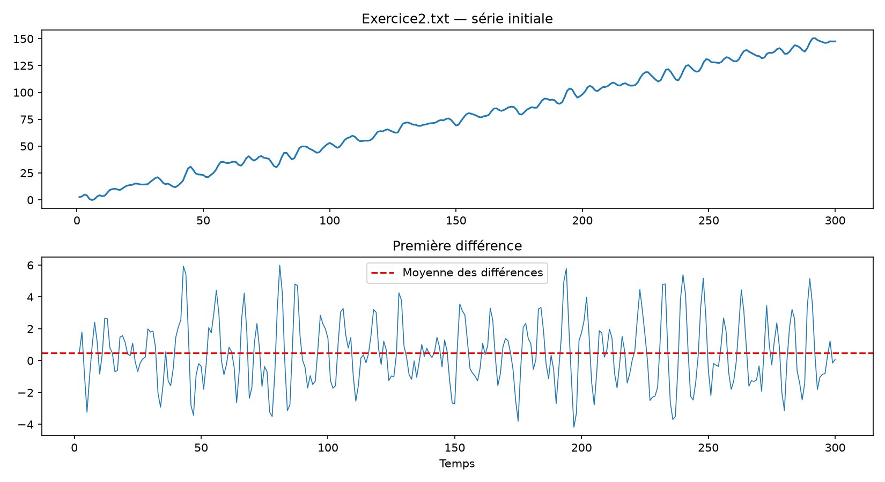

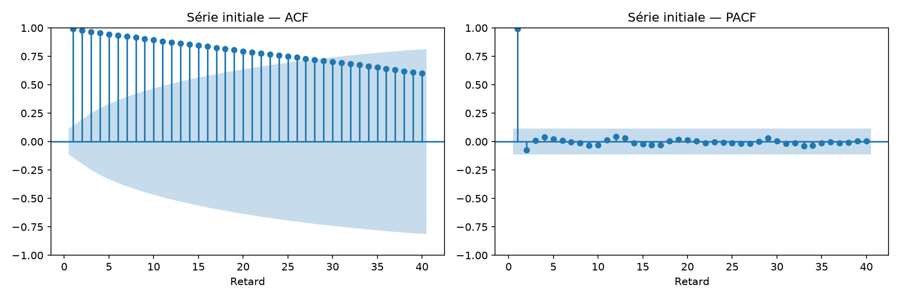

### Question 2 — Combien de différences ?

On applique **une seule différence**, soit $d=1$ :

$$
Y_t=\Delta X_t=X_t-X_{t-1}.
$$

```python
data_diff = np.diff(data_prediction)
plt.plot(np.arange(2, len(data_prediction) + 1), data_diff)
plt.axhline(data_diff.mean(), color="red", linestyle="--")
plt.title("Première différence")
plt.show()
```

La série différenciée fluctue autour d'un niveau stable, avec une moyenne
empirique de 0,4846 et un écart-type de 2,0610. Une seconde différence n'est
pas nécessaire. On peut compléter l'observation par ADF et KPSS :

```python
from statsmodels.tsa.stattools import adfuller, kpss

for nom, serie in [("Initiale", data_prediction), ("Différence", data_diff)]:
    print(nom, "p-valeur ADF :", adfuller(serie, regression="c", autolag="AIC")[1])
    print(nom, "p-valeur KPSS :", kpss(serie, regression="c", nlags="auto")[1])
```

| Série | p-valeur ADF | p-valeur KPSS |
|---|---:|---:|
| Initiale | 0,9250 | < 0,01 |
| Première différence | $1{,}65\times10^{-13}$ | > 0,10 |

ADF teste une racine unitaire ; KPSS teste la stationnarité autour d'une
constante dans cette configuration. Ces résultats soutiennent l'utilisation
de la première différence comme série stationnaire. Les valeurs KPSS 0,01
et 0,10 renvoyées par le logiciel sont ici des bornes de sa table, ce qui
explique les avertissements d'interpolation.

**Nuance :** cela ne démontre pas que la série initiale possède une racine
unitaire. Avec une tendance linéaire dans le test ADF (`regression="ct"`),
la p-valeur vaut $2{,}06\times10^{-5}$, ce qui suggère plutôt une série
stationnaire autour d'une tendance déterministe. On suit ici la méthode
des différences demandée ; retirer une tendance linéaire serait une autre
approche possible.

### Question 3 — Proposer des modèles de faible ordre

```python
auto_correlation(data_diff)
plt.show()
```

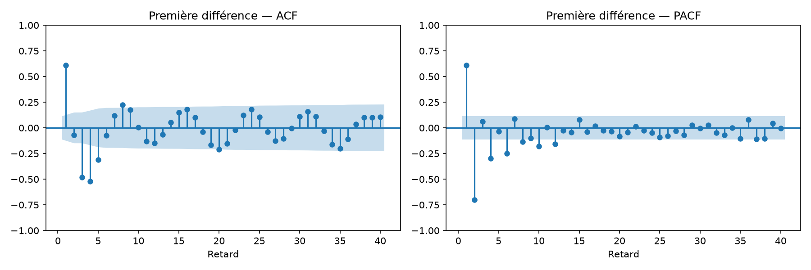

L'ACF oscille : environ 0,609 au retard 1, −0,071 au retard 2, −0,480 au
retard 3 et −0,520 au retard 4. La PACF possède deux premiers pics marqués,
mais aussi des pics ultérieurs : un AR(2) est un premier candidat, sans
coupure suffisamment nette pour s'y limiter. On compare AR(1), AR(2),
MA(1), MA(2), ARMA(1,1), ARMA(2,1), ARMA(1,2) et ARMA(2,2) pour $Y_t$.

Pour préparer les prévisions sur l'échelle initiale, on estime directement
les ARIMA($p,1,q$) correspondants sur $X_t$. `trend="t"` introduit une
tendance linéaire dans $X_t$, donc une moyenne non nulle dans ses différences.
Les AIC/BIC suivants sont tous calculés selon cette même méthode, sur les
mêmes observations :

```python
candidats = [(1, 0), (2, 0), (0, 1), (0, 2), (1, 1), (2, 1), (1, 2), (2, 2)]
for p, q in candidats:
    resultat = ARIMA(data_prediction, order=(p, 1, q), trend="t").fit(
        method_kwargs={"maxiter": 500}
    )
    print((p, q), resultat.aic, resultat.bic)
```

| Modèle sur les différences | AIC | BIC |
|---|---:|---:|
| AR(1) | 1149,037 | 1160,138 |
| AR(2) | 949,444 | 964,246 |
| MA(1) | 1016,477 | 1027,578 |
| MA(2) | 971,248 | 986,050 |
| ARMA(1,1) | 977,955 | 992,757 |
| ARMA(2,1) | 944,166 | 962,668 |
| ARMA(1,2) | 970,757 | 989,259 |
| **ARMA(2,2)** | **878,025** | **900,228** |

On retient **ARMA(2,2) pour $Y_t$**, donc **ARIMA(2,1,2) avec dérive pour
$X_t$**. Un essai supplémentaire ARMA(2,4) donne AIC = 876,217 et BIC =
905,821 : le faible gain d'AIC ne compense pas sa complexité selon le BIC.
Le modèle (2,2), plus simple, a aussi des résidus satisfaisants.

### Question 4 — Estimer les paramètres

```python
results_prediction = ARIMA(
    data_prediction, order=(2, 1, 2), trend="t"
).fit(method_kwargs={"maxiter": 500})
print(results_prediction.summary())
```

| Paramètre | Estimation |
|---|---:|
| Dérive $\delta$ (`x1`) | 0,4960 |
| $\phi_1$ | 1,2179 |
| $\phi_2$ | −0,5873 |
| $\theta_1$ | −0,1742 |
| $\theta_2$ | −0,8256 |
| $\sigma_\varepsilon^2$ | 1,0354 |

Le modèle estimé des différences est :

$$
Y_t-0{,}4960=1{,}2179(Y_{t-1}-0{,}4960)
-0{,}5873(Y_{t-2}-0{,}4960)
+\varepsilon_t-0{,}1742\varepsilon_{t-1}-0{,}8256\varepsilon_{t-2}.
$$

Une racine MA est très proche de 1 (environ 1,00009). Le modèle est près
de la limite d'inversibilité et les erreurs-types des coefficients MA sont
grandes : leur interprétation individuelle est fragile. Ce résultat est
cohérent avec la possibilité d'une tendance déterministe discutée plus haut,
car différencier un bruit stationnaire peut introduire un facteur MA $1-B$.

### Question 5 — Analyser les résidus

On écarte le premier résidu associé à l'initialisation du modèle intégré.

```python
residus_prediction = results_prediction.resid[1:]
display_residus(residus_prediction)
plt.show()
print(acorr_ljungbox(residus_prediction, lags=[10, 20, 30], model_df=4))
```

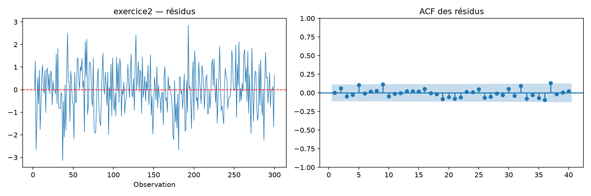

| Retard du test Ljung–Box | p-valeur |
|---|---:|
| 10 | 0,105 |
| 20 | 0,506 |
| 30 | 0,632 |

La moyenne des résidus vaut −0,0077. Leurs fluctuations sont centrées autour
de zéro, sans structure persistante visible ; les tests ne rejettent pas
l'absence d'autocorrélation à 5 %. Jarque–Bera donne une p-valeur de 0,709.
Ces diagnostics sont compatibles avec un bruit blanc et soutiennent l'usage
du modèle pour la prévision, avec la réserve sur la paramétrisation MA.

### Question 6 — Prévoir les 20 temps suivants

On utilise le modèle ajusté sur la série initiale : `get_forecast` rend
directement les prévisions de $X_t$, avec la réintégration des différences.
Il ne faut donc pas cumuler une seconde fois ces prévisions.

```python
prevision = results_prediction.get_forecast(steps=20)
moyenne = np.asarray(prevision.predicted_mean)
intervalle = np.asarray(prevision.conf_int(alpha=0.05))
temps_futurs = np.arange(len(data_prediction) + 1, len(data_prediction) + 21)

plt.figure(figsize=(11, 4))
plt.plot(np.arange(221, 301), data_prediction[-80:], label="Observations")
plt.plot(temps_futurs, moyenne, label="Prévisions")
plt.fill_between(temps_futurs, intervalle[:, 0], intervalle[:, 1], alpha=0.2,
                 label="Intervalle de prévision à 95 %")
plt.xlabel("Temps")
plt.legend()
plt.show()
```

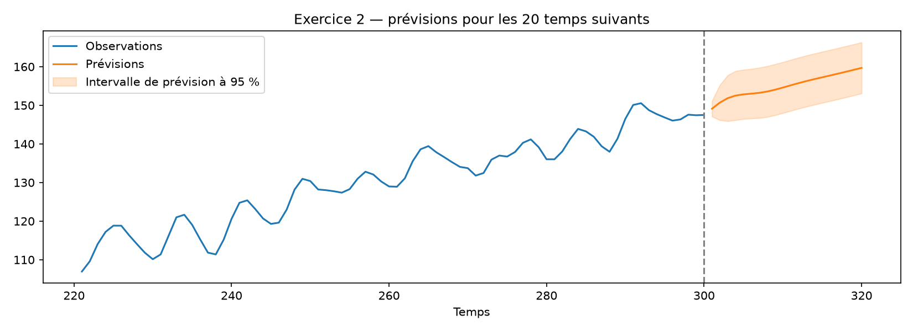

| Temps | Prévision | Intervalle de prévision à 95 % |
|---|---:|---|
| 301 | 149,112 | [147,114 ; 151,109] |
| 302 | 150,690 | [146,139 ; 155,240] |
| 303 | 151,850 | [145,910 ; 157,791] |
| 304 | 152,520 | [146,164 ; 158,876] |
| 305 | 152,837 | [146,460 ; 159,215] |
| 306 | 153,014 | [146,601 ; 159,427] |
| 307 | 153,226 | [146,715 ; 159,736] |
| 308 | 153,563 | [146,983 ; 160,143] |
| 309 | 154,033 | [147,434 ; 160,631] |
| 310 | 154,590 | [147,992 ; 161,189] |
| 311 | 155,176 | [148,572 ; 161,780] |
| 312 | 155,746 | [149,132 ; 162,359] |
| 313 | 156,278 | [149,659 ; 162,898] |
| 314 | 156,776 | [150,155 ; 163,397] |
| 315 | 157,252 | [150,631 ; 163,873] |
| 316 | 157,723 | [151,102 ; 164,345] |
| 317 | 158,201 | [151,579 ; 164,822] |
| 318 | 158,688 | [152,067 ; 165,310] |
| 319 | 159,185 | [152,564 ; 165,807] |
| 320 | 159,687 | [153,066 ; 166,309] |

Les prévisions prolongent la tendance avec une augmentation à long terme
d'environ 0,496 par période. Les intervalles sont conditionnels au modèle
et aux paramètres estimés ; ils n'intègrent pas l'incertitude de choix du
modèle. Les valeurs complètes sont dans
[previsions_exercice2.csv](resultats_tp4/previsions_exercice2.csv).

## Partie 3 — Précipitations mensuelles à San Francisco

On utilise `data/SanFransisco.txt`, qui contient 420 valeurs, soit 35 années
de 12 mois. On suppose, conformément à la période du sujet, que la première
valeur correspond à janvier 1932 et la dernière à décembre 1966. Le fichier
ne précise pas l'unité ; les résultats restent dans les unités du fichier.

### Question 1 — La série semble-t-elle stationnaire ?

```python
import pandas as pd

pluie = pd.Series(
    load_data("data/SanFransisco.txt"),
    index=pd.date_range("1932-01-01", periods=420, freq="MS"),
)
pluie.plot(figsize=(11, 4), title="Précipitations mensuelles")
plt.show()
auto_correlation(pluie)
plt.show()
```

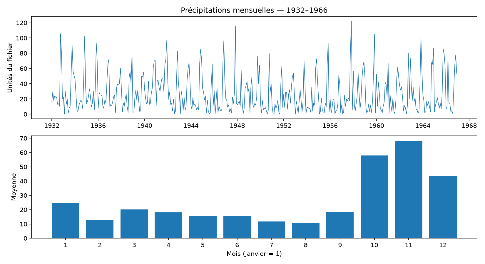

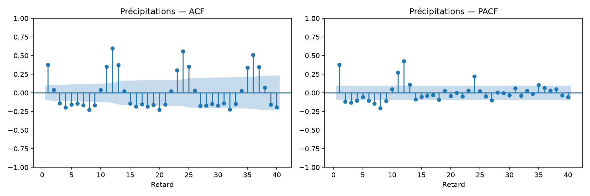

La série ne présente pas de tendance globale évidente, mais une saisonnalité
annuelle marquée. L'ACF vaut environ 0,599, 0,557 et 0,508 aux retards 12,
24 et 36. Les moyennes mensuelles sont très différentes, d'environ 10,95
pour le huitième mois à 68,23 pour le onzième.

La stationnarité autour d'une moyenne constante est donc peu convaincante
pour la série brute. Il faut distinguer une moyenne variant selon le mois
d'une simple corrélation saisonnière : une ACF saisonnière n'interdit pas,
à elle seule, la stationnarité. Le modèle imposé ci-dessous représente la
dépendance annuelle, mais sa capacité à décrire toutes ces variations doit
être vérifiée sur les résidus.

### Question 2 — Caractéristiques du modèle SARIMA(2,0,0,12)

La notation de l'énoncé est abrégée. On l'interprète ici comme un modèle
**SARIMA$(0,0,0)\times(2,0,0)_{12}$**, c'est-à-dire un AR saisonnier d'ordre 2 :

- période saisonnière de 12 mois ;
- dépendance aux retards 12 et 24, avec deux coefficients $\Phi_1,\Phi_2$ ;
- aucune différenciation ordinaire ou saisonnière ;
- aucune partie MA et aucune partie AR non saisonnière.

Avec une moyenne $\mu$, son équation est :

$$
X_t-\mu=\Phi_1(X_{t-12}-\mu)+\Phi_2(X_{t-24}-\mu)+\varepsilon_t.
$$

Sous Python, on fournit séparément `order=(0, 0, 0)` et
`seasonal_order=(2, 0, 0, 12)`. Les racines de
$1-\Phi_1z^{12}-\Phi_2z^{24}$ doivent avoir un module supérieur à 1
pour la stationnarité causale du modèle.

### Question 3 — Estimation et analyse des résidus

On commence par l'ajustement descriptif sur les 420 observations :

```python
results_pluie = ARIMA(
    pluie, order=(0, 0, 0), seasonal_order=(2, 0, 0, 12), trend="c"
).fit(method_kwargs={"maxiter": 500})
print(results_pluie.summary())

# On écarte deux saisons initiales pour limiter l'effet de l'initialisation.
residus_pluie = results_pluie.resid.iloc[24:]
display_residus(residus_pluie)
plt.show()
print(acorr_ljungbox(residus_pluie, lags=[12, 24, 36], model_df=2))

from statsmodels.stats.stattools import jarque_bera
print("p-valeur Jarque–Bera :", jarque_bera(residus_pluie)[1])
```

| Paramètre | Estimation sur 1932–1966 |
|---|---:|
| $\mu$ | 27,2673 |
| $\Phi_1$ (`ar.S.L12`) | 0,4100 |
| $\Phi_2$ (`ar.S.L24`) | 0,3598 |
| $\sigma_\varepsilon^2$ | 319,4088 |

Le plus petit module des racines AR vaut environ 1,01475 : le modèle ajusté
est stationnaire, avec une persistance saisonnière forte. Cela ne démontre
pas la stationnarité de la série réelle, discutée à la question 1.

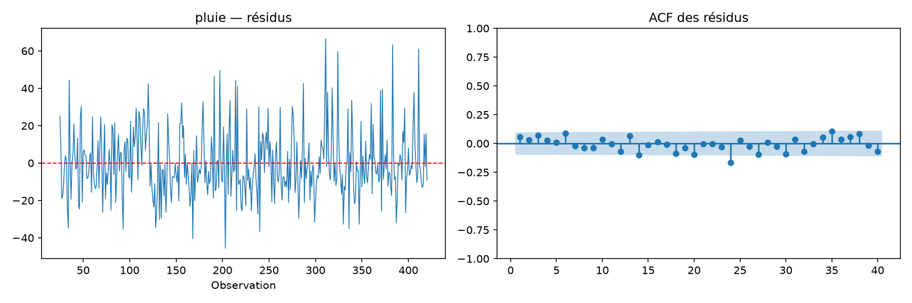

| Retard du test Ljung–Box | p-valeur |
|---|---:|
| 12 | 0,360 |
| 24 | 0,026 |
| 36 | 0,015 |

Les tests à 24 et 36 retards rejettent l'absence d'autocorrélation au seuil
de 5 %. Le test de Jarque–Bera rejette également la normalité, avec une
p-valeur de $1{,}56\times10^{-12}$ ; les résidus sont asymétriques, avec de
grandes valeurs positives.

**Conclusion : le modèle capte une partie de la saisonnalité, mais la
modélisation reste imparfaite.** Les résidus ne peuvent pas être assimilés
sans réserve à un bruit blanc gaussien. Une modélisation avec moyennes
mensuelles ou une transformation des précipitations pourrait être étudiée,
mais on conserve le modèle demandé pour la prévision.

### Question 4 — Prévoir 1964, 1965 et 1966

Pour produire de vraies prévisions, on réestime le modèle **uniquement sur
janvier 1932 à décembre 1963**, soit 384 observations. Les 36 observations
de 1964–1966 servent à évaluer les prévisions et ne sont pas utilisées pour
estimer les paramètres de ce modèle.

```python
apprentissage = pluie.loc[:"1963-12-01"]
observations_test = pluie.loc["1964-01-01":]

results_pluie_train = ARIMA(
    apprentissage,
    order=(0, 0, 0),
    seasonal_order=(2, 0, 0, 12),
    trend="c",
).fit(method_kwargs={"maxiter": 500})

prevision_pluie = results_pluie_train.get_forecast(steps=36)
moyenne_pluie = prevision_pluie.predicted_mean
intervalle_pluie = np.asarray(prevision_pluie.conf_int(alpha=0.05))

plt.figure(figsize=(12, 5))
plt.plot(pluie.loc["1962":], label="Observations")
plt.plot(moyenne_pluie, label="Prévisions depuis fin 1963")
plt.fill_between(moyenne_pluie.index, intervalle_pluie[:, 0],
                 intervalle_pluie[:, 1], alpha=0.2,
                 label="Intervalle de prévision à 95 %")
plt.axvline(pd.Timestamp("1964-01-01"), color="grey", linestyle="--")
plt.legend()
plt.show()

rmse = np.sqrt(np.mean((observations_test - moyenne_pluie) ** 2))
mae = np.mean(np.abs(observations_test - moyenne_pluie))
print("RMSE :", rmse, "MAE :", mae)
```

Sur la période d'apprentissage, les paramètres estimés sont
$\mu=26{,}9686$, $\Phi_1=0{,}3852$, $\Phi_2=0{,}3701$ et
$\sigma_\varepsilon^2=321{,}9486$. Les défauts des résidus persistent :
les p-valeurs de Ljung–Box à 24 et 36 retards valent 0,040 et 0,023.

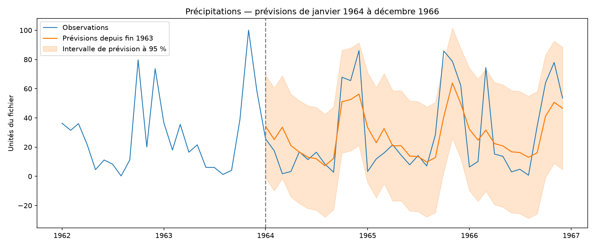

| Mois | Prévision 1964 | Prévision 1965 | Prévision 1966 |
|---|---:|---:|---:|
| Janvier | 34,23 | 33,42 | 32,14 |
| Février | 25,20 | 22,98 | 24,78 |
| Mars | 33,65 | 32,72 | 31,66 |
| Avril | 21,04 | 20,81 | 22,40 |
| Mai | 16,61 | 20,99 | 20,83 |
| Juin | 13,09 | 13,90 | 16,80 |
| Juillet | 12,05 | 13,50 | 16,26 |
| Août | 7,18 | 9,83 | 13,04 |
| Septembre | 12,30 | 12,84 | 16,10 |
| Octobre | 51,09 | 40,66 | 41,17 |
| Novembre | 52,58 | 63,89 | 50,67 |
| Décembre | 56,27 | 49,80 | 46,61 |

Sur ces 36 mois, **RMSE = 18,18** et **MAE = 14,31**, dans les unités du
fichier. Une prévision saisonnière naïve répétant les 12 valeurs de 1963
sur les trois années donne RMSE = 19,79 : le modèle améliore modestement ce
repère sur cette période, tout en lissant fortement certains pics.

Les intervalles gaussiens peuvent avoir une borne inférieure négative,
physiquement impossible pour des précipitations. Ils sont présentés tels
que calculés, sans les tronquer : cela illustre une limite de ce modèle,
renforcée par les diagnostics des résidus. Les prévisions, leurs bornes et
les observations réelles sont dans
[previsions_precipitations.csv](resultats_tp4/previsions_precipitations.csv).

## Reproduire les résultats

Depuis le dossier du TP, avec l'environnement existant :

```sh
../venv/bin/python tp4_suite.py
```

Le script génère les figures, les deux tableaux CSV de prévisions et
`resultats_tp4/resultats.json`. Les calculs ont été effectués avec
`statsmodels` 0.15.0. Tous les ajustements retenus ont convergé. Les exemples
du compte rendu utilisent les imports et fonctions définis précédemment.

Références des fonctions utilisées :

- [ARIMA : ordres, tendance et composante saisonnière](https://www.statsmodels.org/stable/generated/statsmodels.tsa.arima.model.ARIMA.html).
- [Prévisions et intervalles avec get_forecast](https://www.statsmodels.org/stable/generated/statsmodels.tsa.arima.model.ARIMAResults.get_forecast.html).
- [Test de Ljung–Box et correction des degrés de liberté](https://www.statsmodels.org/stable/generated/statsmodels.stats.diagnostic.acorr_ljungbox.html).
- [Tests ADF et KPSS de stationnarité](https://www.statsmodels.org/stable/examples/notebooks/generated/stationarity_detrending_adf_kpss.html).
